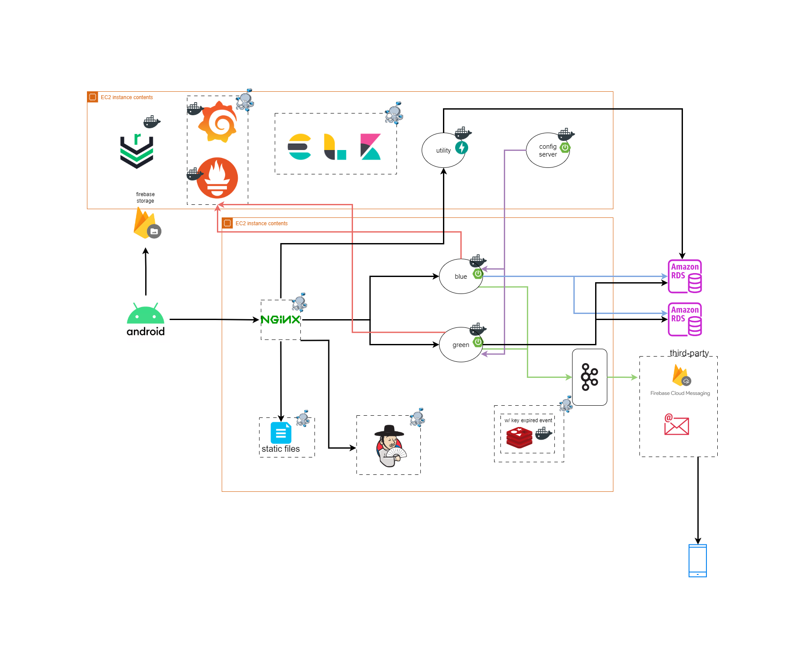
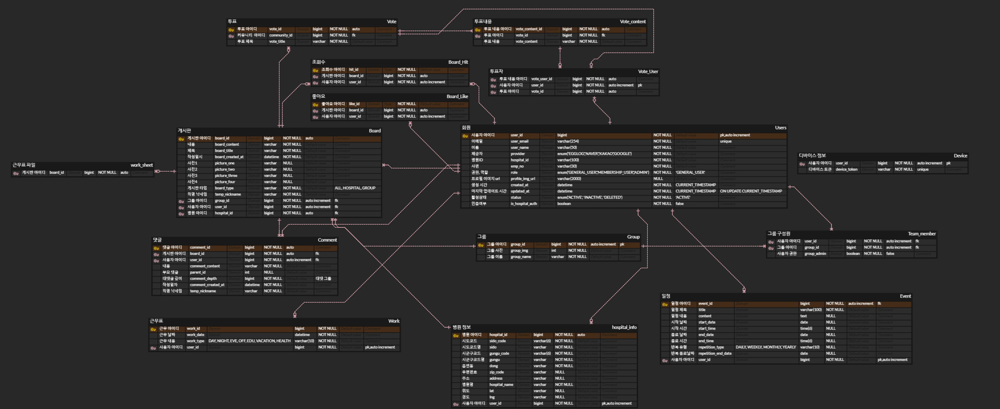

# 에그로그 - 간호사의 근무 관리를 손쉽게!

## ✔ 프로젝트 진행 기간
2024.04. ~ 2024.05.

---

## ✔ 주요 기능
### [근무 관리]
- 근무 등록 자동화
- 개인 및 근무 일정 등록
- 근무 알람 설정
### [그룹]
- 그룹원 간 근무 일정 비교
- 단체 근무표 엑셀 파싱
### [게시판]
- 전체/병원/그룹 게시판형 커뮤니티 운영
### [알림]
- 일정 알림
- 근무 알림
- 게시판 게시글, 작성 글에 대한 댓글 알림

---

## ✔ 주요 기술

* **Mobile Operating Systems** 
  

* **Languages and Frameworks** 
   

* **Database and Caching** 
    

* **logging** 
    

* **monitoring** 
   

* **Development and Deployment Tools** 
     

* **Cloud Storage, Cloud Message** 

* **Web Server and Infrastructure** 
    

* **Design and Project Management** 
    

* **Environments** 
  
---

## ✔ 프로젝트 구조

## ✔ ERD

## ✔ 협업 환경

- Gitlab
    - 코드 버전 관리
    - git flow 브랜치 전략 채택
- JIRA
    - 전주 주말 다음주 목표량을 설정하여 Sprint 진행
    - 업무의 할당량을 정하여 Story Point를 설정 후 진행도 실시간 반영
    - 소멸 차트를 통해 프로젝트 진행도 확인
- Notion
    - 회의록 기록
    - 학습 내용 정리 및 공유
    - 컨벤션 정리

## ✔ 프로젝트 기획 산출물
- [화면명세](https://www.figma.com/file/CBC7Jd5lYIDVGmXsJW9IuL/%ED%98%B8%EB%82%A8%ED%96%A5%EC%9A%B0%ED%9A%8C?type=design&node-id=7%3A2&mode=design&t=hwlzi7JGTaPxcS5w-1)
- [기획 PPT 자료](docs/documents/egg-log.pdf)
- [아키텍처](#-프로젝트-구조)
- [컨벤션](docs/documents/convention.md)

